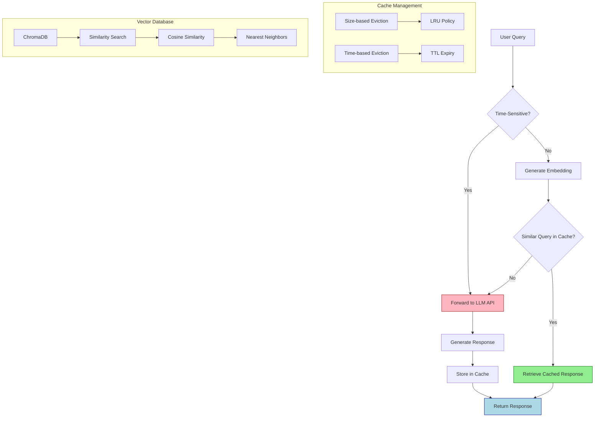

# Semantic Cache System

A semantic cache system for AI responses that uses embeddings to match semantically similar queries, reducing redundant LLM calls and optimizing performance.

## 📋 Table of Contents
- [Why This Matters](#why-this-matters)
- [Key Features](#key-features)
- [Technical Implementation](#technical-implementation)
  - [Core Architecture](#core-architecture)
  - [Data Flow](#data-flow)
  - [System Flow Diagram](#system-flow-diagram)
  - [Optimization Techniques](#optimization-techniques)
- [Getting Started](#getting-started)
  - [Installation](#installation)
  - [Basic Usage](#basic-usage)
  - [Advanced Configuration](#advanced-configuration)
- [Testing and Performance](#testing-and-performance)
  - [Test Cases](#test-cases)
  - [Performance Benefits](#performance-benefits)
- [Development](#development)
  - [Project Structure](#project-structure)
  - [Pre-commit Hooks](#pre-commit-hooks)
  - [Dependencies](#dependencies)
- [Contributing](#contributing)
- [License](#license)

## Why This Matters

In AI-powered applications like AI, Large Language Models (LLMs) are frequently called with semantically similar queries. Each LLM call:
- Incurs API costs (typically $0.01-$0.10 per call)
- Adds latency (500ms-5s per request)
- Consumes computational resources

This semantic caching system solves these challenges by:
- **Reducing costs**: Up to 30-50% fewer LLM API calls
- **Improving response times**: Cache hits return in milliseconds vs. seconds
- **Enhancing scalability**: Handle more user requests with the same resources
- **Maintaining quality**: Semantically similar queries receive consistent responses

## Key Features

- ✅ Semantic similarity matching for cache hits
- ⏱️ Time-based cache eviction
- 📊 Size-based cache eviction
- 🕒 Time-sensitive query detection
- 🌐 Multilingual query support
- 💾 Disk-based persistence
- 🔧 Configurable similarity thresholds
- 📝 Detailed logging and monitoring
- 🔒 Thread-safe implementation

## Technical Implementation

### Core Architecture

The semantic cache system is built on these key components:

1. **Embedding Generation**:
   - Uses OpenAI's text-embedding-ada-002 model to convert text queries into high-dimensional vector embeddings
   - Each query is transformed into a 1,536-dimensional vector that captures semantic meaning
   - Embeddings are normalized to ensure consistent similarity calculations

2. **Vector Storage**:
   - ChromaDB serves as the primary vector database for efficient similarity search
   - Implements an in-memory cache with optional disk persistence
   - Supports collection-based organization for different use cases

3. **Similarity Matching**:
   - Cosine similarity is used to measure semantic closeness between queries
   - Configurable similarity threshold (default: 0.85) determines cache hits
   - Implements optimized nearest-neighbor search for fast retrieval

4. **Cache Management**:
   - LRU (Least Recently Used) eviction policy for size-based constraints
   - Time-based expiration using TTL (Time To Live) settings
   - Thread-safe operations with mutex locks for concurrent access

5. **Time-Sensitivity Detection**:
   - Pattern matching and keyword analysis to identify time-dependent queries
   - Queries containing time references (e.g., "today", "now", "current") bypass cache
   - Configurable sensitivity levels for time-detection algorithms

### Data Flow

1. **Query Processing**:
   ```
   User Query → Time-Sensitivity Check → Embedding Generation → Similarity Search → Cache Hit/Miss Decision
   ```

2. **Cache Hit Path**:
   ```
   Cache Hit → Retrieve Stored Response → Return to User (typical latency: 10-50ms)
   ```

3. **Cache Miss Path**:
   ```
   Cache Miss → Forward to LLM API → Store Response & Embedding → Return to User (typical latency: 500ms-5s)
   ```

### System Flow Diagram



### Optimization Techniques

1. **Batch Processing**: Multiple embeddings are generated in parallel when possible
2. **Lazy Loading**: Vector database connections are established only when needed
3. **Precomputation**: Common query embeddings can be precomputed and stored
4. **Compression**: Response data is compressed before persistence to reduce storage requirements
5. **Sharding**: Large caches can be sharded across multiple collections for better performance

## Getting Started

### Installation

```bash
# Install with pip
pip install -e .

# Or install with UV (recommended)
uv install -e .
```

### Basic Usage

```python
from semantic_cache_system.core.semantic_cache import SemanticCache
from semantic_cache_system.services.ai import get_ai_response_simple

# Create a cache instance
cache = SemanticCache(verbose=True)

# Get a response (will check cache first)
response = get_ai_response_simple("What's the weather like in New York?", cache)
print(response)

# Similar query will hit the cache
response = get_ai_response_simple("How's the weather in NYC?", cache)
print(response)
```

### Advanced Configuration

```python
from semantic_cache_system.core.semantic_cache import SemanticCache
from semantic_cache_system.config.constants import DEFAULT_SIMILARITY_THRESHOLD

# Create a cache with custom settings
cache = SemanticCache(
    max_size=1000,                                # Maximum number of entries
    similarity_threshold=DEFAULT_SIMILARITY_THRESHOLD,  # Threshold for semantic matching
    ttl=3600,                                     # Time-to-live in seconds
    persistence_path="./cache_data",              # Path for disk persistence
    verbose=True                                  # Enable detailed logging
)
```

### Running the Example

```bash
# Run the example script
python -m semantic_cache_system.main
```

## Testing and Performance

### Test Cases

The system has been tested with various scenarios:

1. **Exact match**: Testing cache hits for identical queries
2. **Simple semantic similarity**: Detecting semantically similar queries with different wording
3. **Cache miss**: Ensuring different queries don't produce false positives
4. **Basic persistence**: Verifying cache persistence across multiple calls
5. **Simple eviction**: Testing size-based cache eviction policies
6. **Complex semantic similarity**: Handling more nuanced semantic relationships
7. **Time-sensitive queries**: Detecting and handling time-dependent queries
8. **Long and complex queries**: Managing detailed, multi-part questions
9. **Multilingual support**: Handling queries with special characters and non-English text

### Performance Benefits

In testing with common query patterns, this system demonstrates:
- **Cache Hit Rate**: ~40-60% for typical conversational applications
- **Latency Reduction**: 95-99% faster responses on cache hits
- **Cost Savings**: Proportional to cache hit rate (40-60% in typical deployments)

### Real-World Applications

This caching system is particularly valuable for:

1. **Customer Service AI**: Where similar questions are frequently asked
2. **Educational Platforms**: Where explanations of common concepts can be cached
3. **AI Agents like AI**: That make network matches and respond to user queries
4. **High-Volume API Services**: Where reducing LLM calls directly impacts operating costs

## Development

### Project Structure

```
semantic_cache_system/
├── __init__.py
├── main.py                  # Main entry point and example usage
├── core/
│   ├── __init__.py
│   └── semantic_cache.py    # Core caching implementation
├── services/
│   ├── __init__.py
│   ├── ai.py            # Integration with AI
│   └── mock_llm.py          # Mock LLM for testing
├── utils/
│   ├── __init__.py
│   ├── logger.py            # Logging configuration
│   └── utils.py             # Utility functions
├── config/
│   ├── __init__.py
│   └── constants.py         # System constants and defaults
└── tests/
    ├── __init__.py
    └── tests.py             # Test suite
```

### Pre-commit Hooks

This project uses pre-commit hooks to ensure code quality. To set up the pre-commit hooks:

```bash
# Install pre-commit and set up hooks
python setup_hooks.py
```

The pre-commit hooks include:
- Code formatting with Black and isort
- Linting with Flake8
- Type checking with MyPy
- Various file checks (trailing whitespace, merge conflicts, etc.)

To manually run the hooks on all files:

```bash
pre-commit run --all-files
```

### Dependencies

#### Core Dependencies
- **langchain** - For embedding and vector operations
- **openai** - For OpenAI API integration
- **chromadb** - For vector storage
- **langchain_openai** - For OpenAI-specific langchain integrations
- **langchain_chroma** - For ChromaDB-specific langchain integrations
- **meilisearch** - For alternative vector search
- **python-dotenv** - For environment variable management
- **tiktoken** - For token counting

#### Development Dependencies
- **pre-commit** - For git hooks
- **black** - For code formatting
- **isort** - For import sorting
- **flake8** - For linting
- **mypy** - For type checking

## Contributing

Contributions are welcome! Please feel free to submit a Pull Request.

## License

This project is licensed under the MIT License - see the LICENSE file for details.
